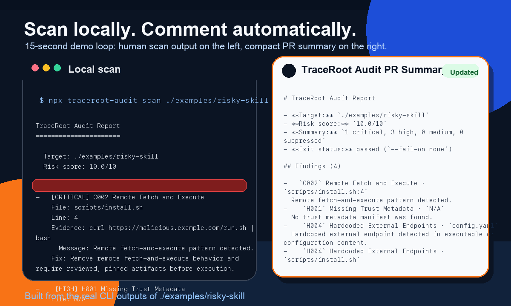

# TraceRoot Audit

[简体中文](./README.zh-CN.md)

[](https://www.npmjs.com/package/traceroot-audit)
[](https://github.com/jwwzpf/traceroot-audit/actions/workflows/ci.yml)
[](./LICENSE)

**Open-source scanner for the local files that define what an AI agent can really do.**

TraceRoot Audit helps developers inspect the action surface behind OpenClaw-like local agent ecosystems: runtime configs, skills and tool packages, agent-capable scripts, and the local files that wire shell, network, filesystem, email, and other real actions together.



## Why it matters

Agent skills can now trigger real actions like:

- shell execution
- file access
- network calls
- email changes
- purchases or other side effects

TraceRoot Audit keeps the product narrow: it scans local action-capable surfaces and turns them into practical findings.

## Local development

```bash
pnpm install
pnpm build
```

If you do not use `pnpm`, local development works with npm too:

```bash
npm install
npm run build
```

## Fastest local usage

Run without global install:

```bash
npx traceroot-audit doctor
npx traceroot-audit doctor /path/to/openclaw
npx traceroot-audit doctor /path/to/openclaw --watch --interval 60
```

For most users, `doctor` is now the main entry point. It finds a likely surface, asks what you actually want the AI to do, generates a smaller approved boundary, prepares a safer patch bundle, and can keep watching the boundary with `--watch`.

We are also defining the next product step beyond static scanning: a local runtime audit layer that watches live agent behavior, writes local audit logs, and raises attention when high-risk actions begin. The current v1 spec lives in [docs/runtime-audit-v1.md](./docs/runtime-audit-v1.md).

The first local audit slice is now live:

```bash
npx traceroot-audit doctor /path/to/openclaw --watch --interval 60
npx traceroot-audit logs
```

If you want the lower-level commands, they still exist:

Inspect what this directory looks like before you scan it:

```bash
node dist/cli/index.js discover
```

Let TraceRoot look for common agent/runtime locations on this machine:

```bash
node dist/cli/index.js discover --host
```

If you also want host discovery to include the current workspace you launched from:

```bash
node dist/cli/index.js discover --host --include-cwd
```

Scan the current directory:

```bash
npx traceroot-audit scan .
```

Create a starter trust manifest:

```bash
node dist/cli/index.js init
```

Start the interactive hardening wizard:

```bash
node dist/cli/index.js harden --host
```

Keep watching a machine or project for new agent surfaces and risk changes:

```bash
node dist/cli/index.js guard --host --interval 60
```

Review the local runtime audit timeline:

```bash
node dist/cli/index.js logs
node dist/cli/index.js logs --today
node dist/cli/index.js logs --tail
```

Record current findings as a baseline:

```bash
node dist/cli/index.js baseline
```

## Quick start

Most users should start here:

```bash
node dist/cli/index.js doctor
```

If you already know the target directory:

```bash
node dist/cli/index.js doctor /path/to/openclaw
```

Keep watching the same target without switching to another mental model:

```bash
node dist/cli/index.js doctor /path/to/openclaw --watch --interval 60
```

Advanced workflow:

Discover what TraceRoot can scan in the current project:

```bash
node dist/cli/index.js discover .
```

Find likely OpenClaw/runtime/skill surfaces on this machine:

```bash
node dist/cli/index.js discover --host
```

Scan the current project:

```bash
node dist/cli/index.js scan .
```

Scan an OpenClaw-like local runtime repo:

```bash
node dist/cli/index.js scan /path/to/openclaw
```

Scan a specific skill or tool package:

```bash
node dist/cli/index.js scan /path/to/openclaw/skills/send-email-skill
```

Run the interactive hardening wizard against a target you already know:

```bash
node dist/cli/index.js harden /path/to/openclaw
```

Scan the bundled risky example:

```bash
node dist/cli/index.js scan ./examples/risky-skill
```

Output JSON for CI:

```bash
node dist/cli/index.js scan . --format json
```

Output Markdown for PRs or issues:

```bash
node dist/cli/index.js scan . --format markdown
```

Output compact Markdown for PR comments on mobile:

```bash
node dist/cli/index.js scan . --format markdown --compact
```

Fail CI on high-risk findings:

```bash
node dist/cli/index.js scan . --fail-on high
```

Ignore an existing baseline for one scan:

```bash
node dist/cli/index.js scan . --ignore-baseline
```

Use an explicit baseline file:

```bash
node dist/cli/index.js scan . --baseline ./traceroot.baseline.json
```

Generate SARIF for GitHub code scanning:

```bash
node dist/cli/index.js scan . --format sarif > traceroot.sarif
```

List built-in rules:

```bash
node dist/cli/index.js rules
```

Explain a rule:

```bash
node dist/cli/index.js explain C002
```

## The simplest path: doctor

For most users, the main command is now `doctor`.

```bash
node dist/cli/index.js doctor
```

If you want TraceRoot to stay with you and keep watching the boundary afterwards:

```bash
node dist/cli/index.js doctor --watch --interval 60
```

Review what happened afterwards:

```bash
node dist/cli/index.js logs
node dist/cli/index.js logs --target /path/to/openclaw --today
```

`doctor` will:

1. find a likely OpenClaw / runtime / skill surface
2. ask what you actually want the AI to do
3. generate a smaller approved boundary
4. generate a safer patch bundle you can actually use
5. tell you what still needs to change in the live setup

If you already know the directory:

```bash
node dist/cli/index.js doctor /path/to/openclaw
```

## Interactive hardening wizard

TraceRoot Audit now includes a guided `harden` flow for users who do not want to reason through capabilities manually.

`harden` is the advanced form of the same workflow. Most users should start with `doctor`.

It walks through:

1. finding a likely OpenClaw/runtime/skill surface
2. choosing one or more workflows you actually want the AI to perform
3. choosing approval, file-write, and exposure policies
4. generating a smaller, safer suggested profile for that workflow mix

Example:

```bash
node dist/cli/index.js harden --host
```

The first release of the wizard supports these workflow choices:

- 📧 Email triage and reply
- 🧵 Social posting and publishing
- 🛒 Shopping and ordering automation
- 💻 PR review and code feedback
- 💬 Chat support and message handling
- 📈 Market monitoring and chart analysis

After the wizard runs, TraceRoot can generate:

- `traceroot.hardened.report.md`
- `traceroot.hardened.profile.json`
- `traceroot.manifest.hardened.json` or `.yaml`

## Apply the safer bundle

Once you have approved a smaller boundary with `harden`, run `apply` to generate files you can actually use:

```bash
node dist/cli/index.js apply /path/to/openclaw
```

`apply` currently generates:

- `traceroot.manifest.hardened.json` or `.yaml`
- `traceroot.env.agent.example`
- `docker-compose.traceroot.override.yml` when TraceRoot can safely localize published ports
- `traceroot.apply.plan.md`

## Boundary guard

Once you have approved a safer profile, `doctor --watch` is now the recommended way to keep watching the target and tell you when the live setup is still broader than that approved boundary or drifts beyond it later. The lower-level `guard` command still exists for advanced flows.

Example:

```bash
node dist/cli/index.js doctor /path/to/openclaw --watch --interval 60
```

With a saved `traceroot.hardened.profile.json`, guard now highlights:

- capabilities that are still broader than the approved workflow mix
- public exposure that came back even though you chose localhost-only
- missing approval gates for side-effecting actions
- unrelated secrets still visible to the runtime

## What to scan

TraceRoot Audit works best when you point it at the local files that define what an agent can really do:

- local runtime configs like `.env`, `docker-compose.yml`, and runtime wiring files
- skill, tool, plugin, and MCP server packages
- scripts and source files that an agent can execute to take actions

If you are not sure where to start, run:

```bash
node dist/cli/index.js discover .
```

If you do not know where OpenClaw, skills, or runtime configs live on your machine, run:

```bash
node dist/cli/index.js discover --host
```

`discover` will classify the target as one of:

- `agent project`
- `skill / tool package`
- `runtime config`

and suggest the most useful paths to scan next.

`discover --host` uses a targeted search of common local locations such as:

- `~/.openclaw`
- `~/.mcp`
- `~/.config`
- `~/Code`
- `~/Projects`
- `~/workspace`
- `~/Library/Application Support` on macOS

By default it excludes the current working directory subtree, so host discovery behaves like a machine-level search instead of simply rediscovering the repo you launched it from. If you want both behaviors, add `--include-cwd`.

It does **not** do a blind full-disk crawl. The goal is to help non-expert users find likely agent action surfaces without first understanding where OpenClaw or skill packages are installed.

Host discovery now also recommends the next best action for each candidate:

- `scan` when TraceRoot should quantify current blast radius first
- `harden` when the surface already looks like a reusable skill/tool/MCP surface that should be tightened before trust

## Ignore generated or irrelevant paths

Add a `.tracerootignore` file at the scan root:

```text
# Ignore build output
dist/**
coverage/**

# Ignore vendored skills or generated scripts
vendor/**
generated/**
```

TraceRoot Audit will skip matching files during discovery.

## Baseline workflow

Baseline support is for gradual rollout in noisy repositories:

```bash
node dist/cli/index.js baseline .
node dist/cli/index.js scan .
```

The first command writes `traceroot.baseline.json`. After that, `scan` auto-detects the file and suppresses already accepted findings so that only new findings remain visible.

## GitHub Actions

Use the bundled composite action:

```yaml
name: TraceRoot Audit

on:
  pull_request:
  push:
    branches: [main]

jobs:
  audit:
    runs-on: ubuntu-latest
    steps:
      - uses: actions/checkout@v4
      - uses: your-org/traceroot-audit@v1
        with:
          path: .
          fail-on: high
```

Replace `your-org` with the GitHub owner after you publish and tag `v1`.

If you prefer plain CLI in CI:

```yaml
- uses: actions/checkout@v4
- uses: pnpm/action-setup@v4
  with:
    version: 10.6.5
- uses: actions/setup-node@v4
  with:
    node-version: 20
- run: pnpm install --no-frozen-lockfile
- run: pnpm build
- run: node dist/cli/index.js scan . --fail-on high
```

Upload SARIF to GitHub code scanning:

```yaml
- uses: actions/checkout@v4
- uses: pnpm/action-setup@v4
  with:
    version: 10.6.5
- uses: actions/setup-node@v4
  with:
    node-version: 20
- run: pnpm install --no-frozen-lockfile
- run: pnpm build
- run: node dist/cli/index.js scan . --format sarif > traceroot.sarif
- uses: github/codeql-action/upload-sarif@v3
  with:
    sarif_file: traceroot.sarif
```

PR comment summary job:

The repository CI now includes a PR summary job that runs:

```bash
node dist/cli/index.js scan . --format markdown --compact
```

and upserts the result as a PR comment instead of spamming a new comment on every push.
This repository also checks in a root `traceroot.baseline.json`, so the PR comment stays focused on newly introduced findings instead of known demo or fixture noise.
For forked pull requests, the workflow falls back to the GitHub Actions job summary because GitHub exposes a read-only token on `pull_request` events.

## Publish readiness

The package is set up for `npx traceroot-audit ...` and public npm publishing.

Useful checks before publishing:

```bash
npm run lint
npm test
npm run build
npm run package:check
```

## Automatic release

The repository now includes a tag-driven npm publish workflow in [.github/workflows/release.yml](./.github/workflows/release.yml).

To use it:

1. Configure npm trusted publishing for this package and repository.
2. Bump `package.json` version.
3. Push a tag like `v0.2.0`.

The workflow will lint, test, build, dry-run the package, publish to npm, and attach the generated tarball to the GitHub Release.

If you cannot use trusted publishing, a granular npm token is the fallback. In that case, add it as `NPM_TOKEN` in GitHub Actions secrets and adjust the publish step to use `NODE_AUTH_TOKEN`.

## Implemented rules

- `C001` Public Runtime Exposure
- `C002` Remote Fetch and Execute
- `C003` Untrusted Shell + Network + Filesystem Combo
- `C004` Dangerous Destructive Capability Without Safeguards
- `H001` Missing Trust Metadata
- `H002` Overbroad Permission Declaration
- `H004` Hardcoded External Endpoints
- `H006` No Replay / Idempotency Declaration
- `H007` Missing Interrupt / Stop Contract Declaration

See [docs/rules.md](./docs/rules.md) for rule details and the minimal manifest schema.

## First milestone

The v1 milestone is intentionally small:

1. `pnpm build`
2. `node dist/cli/index.js init`
3. `node dist/cli/index.js scan ./examples/risky-skill`
4. `node dist/cli/index.js scan ./examples/risky-skill --format json`
5. `node dist/cli/index.js scan ./examples/risky-skill --fail-on high`

## License

Apache-2.0
